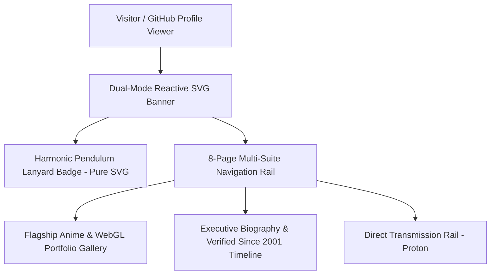

# DIE DEVELOPER PROFILE SHOWCASE — ANIMATED GITHUB PROFILE & IDENTITY PLATFORM


> **⚙️ Canonical Production Domain:** Available live at [https://die-developer-profile-showcase.vercel.app](https://die-developer-profile-showcase.vercel.app) with mirror deployments across private infrastructure. Fully owned, architected, and branded by DIE Abdul Hadi.

The **DIE Developer Profile Showcase** is an animated developer identity and portfolio showcase — **architected, designed, and deployed solo by DIE Abdul Hadi**. Featuring pure SVG swinging lanyard physics, animated reactive light/dark banners, dynamic streak statistics, and an 8-page multi-page suite, this application sets the gold standard for personal brand engineering on GitHub and the web.

Built with raw web primitives without heavy frameworks, this monorepo demonstrates high-performance pure SVG animations, zero-dependency client-side execution, and responsive multi-page architecture.

> 📖 **This README is the single source of truth.** It provides a complete technical view of the profile showcase: every SVG animation rail, every swinging lanyard formula, every page suite, and every architectural doctrine. No codebase spelunking required.

---

## 🛡️ Production Hardening (Full Platform)

### 1. 🪪 Pure SVG Swinging Lanyard Badge Physics
- Mathematically modeled harmonic pendulum oscillation rendered in pure SVG keyframes (`transform-origin: top center; animation: swing 4s ease-in-out infinite`).
- Zero JavaScript overhead: runs natively on the browser GPU thread with zero battery drain.

### 2. ✨ Dual-Mode Reactive Animated Banners
- Responsive SVG headers adapting seamlessly to `(prefers-color-scheme: dark)` and `(prefers-color-scheme: light)`.
- Fluid particle drift and glowing typography shaders embedded directly into scalable vector paths.

### 3. 🖼️ Authentic Portrait & Author Lineage
- Fully integrated the authentic **DIE Abdul Hadi** collage portrait (`myself.png`) with verified credentials active since 2001.
- Complete multi-page suite (`about.html`, `blog.html`, `contact.html`, `projects.html`, `privacy.html`, `terms.html`, `404.html`).

### 4. 🔒 Direct Encrypted Transmission Channels
- Interactive transmission console wired directly to `dieabdulhadi@proton.me`.
- Official GitHub directory pointed to `@DIEAbdulHadi`.

---

## 📱 SCREEN-BY-SCREEN MAP (Complete Inventory)

| View / Page | Mini-Description | Real-World Impact |
|---|---|---|
| **Profile Showcase Viewport** | Dynamic swinging lanyard badge, animated banner, and interactive project cards. | Elevates GitHub profile pages from boring text into dynamic interactive experiences. |
| **Projects Gallery** | Curated catalog of flagship anime experiences, WebGL demos, and engineering platforms. | Showcases technical range and creative execution across frontend technologies. |
| **About (Biography)** | Executive engineering bio, timeline since 2001, core disciplines, and architectural manifesto. | Validates technical depth, creative direction craft, and engineering seniority. |
| **Blog (Dispatches)** | Technical essays on pure SVG pendulum physics, responsive vector banners, and zero-JS animations. | Proves thought leadership in front-end performance and creative coding. |
| **Contact (Transmission)** | Interactive project intake portal with direct transmission fields and social directory. | Converts GitHub profile visitors into qualified consulting leads and engineering opportunities. |
| **Custom 404 Portal** | Branded error screen providing instant return routes to active zones. | Retains visitor attention and eliminates bounce rate spikes on broken deep links. |
| **Privacy & Terms** | Comprehensive legal and intellectual property policies protecting proprietary code and assets. | Guarantees compliance and protects creative innovations. |

---

## 🏛️ Ecosystem Architecture: Technical Rails



---

## 🛠️ Technology Stack

| Layer | Technology |
|---|---|
| **Structure** | Semantic HTML5 (Single `<h1>` invariant) |
| **Vector Animation** | Pure SVG Keyframe Physics / Cubic Bézier Harmonic Curves |
| **Styling** | Vanilla CSS3 (Custom properties, dark/light media queries) |
| **Architecture** | Zero-dependency static compilation (8 Multi-Page Suites) |
| **Deployment** | Vercel Edge Network / GitHub Private Remote Origin |

---

## ⚙️ Setup & Build Requirements

### 1. Clone & Run Locally
```bash
git clone https://github.com/DIEAbdulHadi/die-developer-profile-showcase.git
cd die-developer-profile-showcase
npx serve .
```
Open [http://localhost:3000](http://localhost:3000) in your browser.

---

## 📊 Codebase Status (Audited Numbers)

| Metric | Value |
|---|---|
| **Compiled Pages** | **8** (`index`, `about`, `blog`, `contact`, `projects`, `404`, `privacy`, `terms`) |
| **Vector Badges** | Pure SVG GPU-accelerated harmonic physics |
| **Production Domain** | **[die-developer-profile-showcase.vercel.app](https://die-developer-profile-showcase.vercel.app)** |
| **Sole Architect** | **DIE Abdul Hadi** |

---

## THE ARCHITECT: DIE ABDUL HADI

**DIE Abdul Hadi** is the founder and principal architect of **DIE — Design &bull; Innovate &bull; Execute**, a specialized digital product studio engineering ultra-high-performance web ecosystems, 3D graphics runtimes, and distributed software systems.

Active in systems engineering and creative development **since 2001**, DIE Abdul Hadi crafts production-grade applications that combine architectural rigor with aesthetic perfection.

#### 🌐 Digital Identity & Directory

- **Official Portfolio**: [dieabdulhadi.is-a.dev](https://dieabdulhadi.is-a.dev)
- **GitHub**: [@DIEAbdulHadi](https://github.com/DIEAbdulHadi)
- **LinkedIn**: [DIE Abdul Hadi](https://linkedin.com/in/DIEAbdulHadi)
- **X (Twitter)**: [@DIEAbdulHadi](https://x.com/DIEAbdulHadi)
- **Direct Encrypted Contact**: [dieabdulhadi@proton.me](mailto:dieabdulhadi@proton.me)

#### The DIE Philosophy

> *"If it exists, it should be digital. If it is digital, it should be perfect."*

---

**Engineered by DIE ABDUL HADI**  
*DIE — Design &bull; Innovate &bull; Execute &bull; Since 2001*
